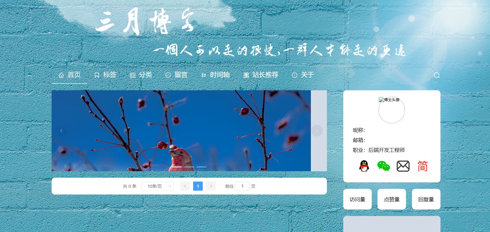

# blog——博客系统

## 项目简介

一个基于Spring Boot 2.1.0、JDK1.8+ 、 Mybatis、通用mapper、Redis、Vue、Element UI、Vuetify的前后端分离的开源博客系统。

**默认管理员账号密码：** 

## 项目源码

|     |   后端源码  |  前台源码  | 后台源码 |
|---  |--- | --- |---  |
|  GitHub  | [https://github.com/duktig666/blog](https://github.com/duktig666/blog) | [https://github.com/duktig666/blog-protal-web](https://github.com/duktig666/blog-protal-web) | [https://github.com/duktig666/blog-manage-web](https://github.com/duktig666/blog-manage-web) |
| Gitee | [https://gitee.com/duktig666/blog](https://gitee.com/duktig666/blog) | [https://gitee.com/duktig666/blog-protal-web](https://gitee.com/duktig666/blog-protal-web) | [https://gitee.com/duktig666/blog-manage-web](https://gitee.com/duktig666/blog-manage-web) |

## 技术栈

### 后端

- 基本：Spring Boot + JDK1.8 + 
- 持久化技术：MySQL + Mybatis + 通用mapper
- 缓存：Redis
- 文件上传/下载：FastDFS
- 工具：Lombok + Swagger + Hutool + Fastjson

### 前台

- HTML + CSS + JS
- jQuery + Ajax
- H5方式引用 Vue + Element UI + Vuetify

### 后台

- Vue
- Element UI
- Vuetify
- axios

## 文件夹结构

### 后端

```
|- blog-common 	公共模块
	|-- config 	配置
	|-- exception 	异常处理
	|-- mapper 	Mybatis的通用mapper
	|-- page 	分页处理
	|-- util 	工具包
|- blog-system 	核心模块
	|-- config 	核心模块配置
	|-- module 	模块
		|--- business 	核心业务模块
		|--- upload 	文件上传下载
		|--- AppRun.java 	启动类
|- sql 	数据库文件
|- pom.xml 	所用依赖
```

### 前台

```
|- css
|- html
|- img 	图片资源
|- js
|- plugins 	插件
    |-- element 	H5项目引用Element UI
    |-- jquery 	引入jquery
    |-- vue 	H5项目引入vue
    |-- vuetify	H5项目引入vuetify
|- index.html 	入口文件
```

### 后台

```
|-- public 存放静态资源，存放在该文件夹的东西不会被打包影响，而是会原封不动的输出到dist文件夹中
    |-- favicon.ico 网站图标
    |-- index.html 主页，项目入口
|-- src
    |- assets  静态资源
    |-- components  公用组件
    |-- router  路由配置
    |-- page  页面
    |-- app.vue  根组件
	|-- main.js  入口文件
	|-- menu.js  菜单导航 
|-- .gitignore  git忽略上传的文件格式
|-- vue.config.js  cli配置文件
```

## 部分UI




## 其他

- [博客管理系统需求分析](./doc/博客管理系统需求分析.md)
- [个人博客参考网站](./doc/个人博客参考网站.md)
- 其他更多内容请到【[blog仓库的doc文件夹](https://github.com/duktig666/blog/tree/master/doc)】参看

