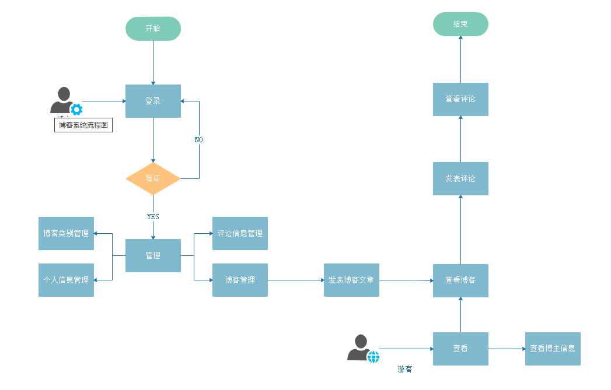
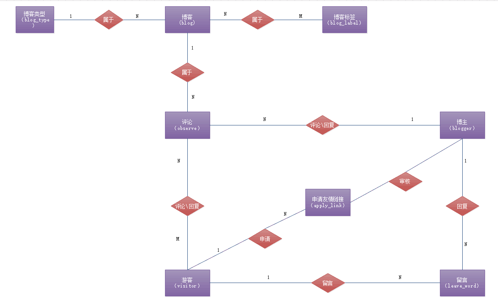
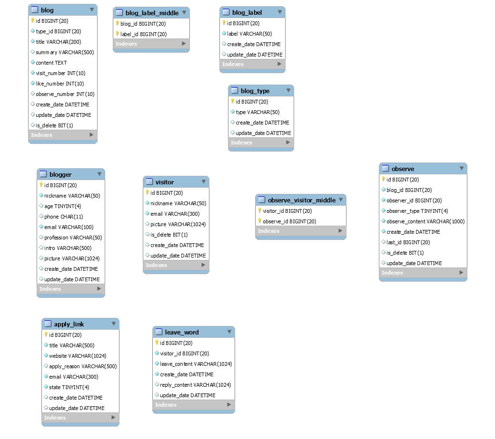

# 博客管理系统需求分析

## 系统简介

开发一个个人的博客管理系统，具备基本的博客功能，主要用于发表博客，记录个人生活日常，学习心得，技术分享等，供他人浏览，查阅，评论等。

## 版本信息

参看 [版本更迭信息.md](./版本更迭信息.md)

### 系统结构

个人博客系统分为两个角色，分别是博主和游客。只有博主才能登录后台管理系统，进行博客发表。

1. 首先要通过用户名和密码登录后台管理系统，才能发布博客。
2. 博主和游客都可以阅读博客。
3. 博主和游客都可以发表评论。

## 系统要求

## ER图

## 数据字典

### 数据库：blog_system

#### 1.博主表：blogger

id 博主id
nickname 昵称
phone 手机号
email 邮箱
profession 职业
intro 个人简介
picture 博主头像

#### 2.游客表 visitor

id 游客id
nickname 游客昵称
email 游客邮箱
picture 游客头像（字段需要考虑，第一版本地默认头像）
create_date 创建时间
id_delete 是否删除（回收站保留字段）

#### 3.博客类型表 blog_type

id 博客类型id
type 博客类型
create_date 创建时间
is_delete 是否删除（回收站保留字段）

#### 4.博客标签表 blog_label

id 博客标签id
label 博客标签
create_date 创建时间
is_delete 是否删除（回收站保留字段）

#### 5.博客表 blog

id 博客id
type_id 博客类型id
title 博客标题
summary 博客摘要
content 博客正文
create_date 创建时间
visit_number 浏览量
like_number 点赞量
reply-number 回复量
update_date 修改时间
is_delete 是否删除（回收站保留字段）

#### 6.博客、博客标签中间表（难点）

bolg_id 博客id
label_id 博客标签id   1:n的关系如何处理？？？

#### 一级评论表 observe_first

id 一级评论id
blog_id 博客id
observer_id 评论者
observer_type 评论者类型（游客，博主）
observe_content 评论内容
observe_date 评论时间

#### 二级评论表observe_second

id 二级评论id
observe_first_id 所属一级评论id

observer_id 二级评论者
observer_type 二级评论者类型（游客，博主）
observe_content 二级评论内容
observe_date 二级评论时间

replier_id 二级回复者id
replier_type 二级评论者类型（游客，博主）
reply_content 二级回复内容
reply_date 二级回复时间

#### 7.评论回复表（难点） observe

id 评论id
blog_id 博客id
observer_id 评论者
observer_type 评论者类型（游客，博主）
observe_content 评论内容
observe_date 评论时间
last_id 上一条评论的id（使用链表，表示回复关系，null代表一级评论）

#### 8.留言表 leave_word

id 留言id
visitor_id 游客id
leave_content 留言内容
leave_date 留言时间
reply_content 博主回复内容
reply_date 博主回复时间

#### 9.友情链接申请表 apply_link

id 友情链接申请id
title 网站标题
website 网址
email 邮箱
state 申请状态
create_date 申请时间
update_date 处理时间

